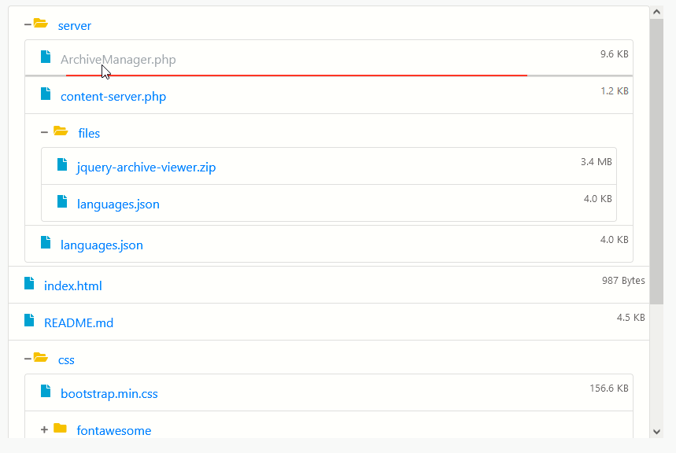
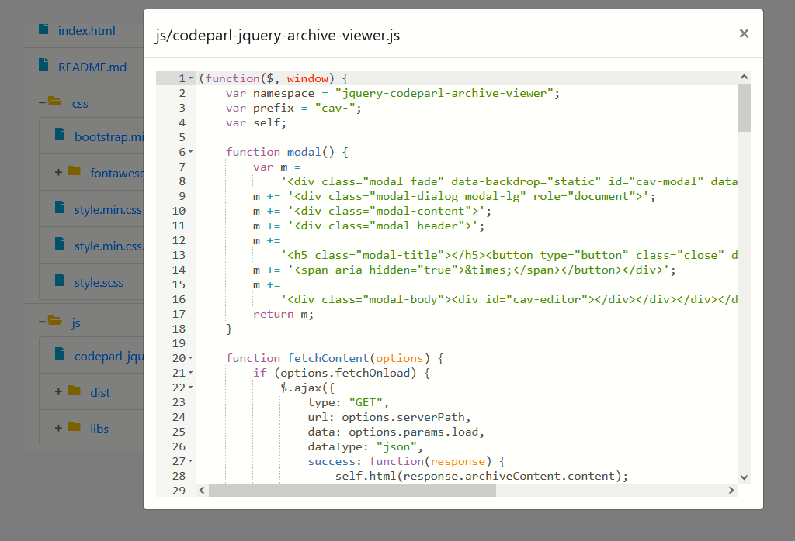

# CodeParl jQuery Archive Viewer

CodeParl jQuery Archive Viewer for bootstrap 4 allows you to view
the content of an archive (.zip) file stored on your server.
This plugin display files in a hierarchical structure similar
to the one found on Windows Explorer.

This is a jQuery plugin written by Hassan Mugabo [aka @codeparl]

## Requirements

- Bootstrap 4
- jQuery
- Ace editor (http://ace.c9.io)
- FontAweson

## Features

- supports ajax requests
- content previewier (e.g. text and images )
- file download for unsupported content (e.g. binary data)
- Sub-folders
- dispaly of file size details
- content preloaders
- Preview themes

## Screenshots





## Setup Example

Include the required CSS and js files as follows:

first include the css files in the `<head>` element of your page

```html
<head>
  <link
    href="https://cdnjs.cloudflare.com/ajax/libs/font-awesome/5.11.2/css/all.min.css"
    rel="stylesheet"
  />
  <link
    href="https://stackpath.bootstrapcdn.com/bootstrap/4.5.2/css/bootstrap.min.css"
    rel="stylesheet"
  />
  <link href="codeparl-jquery-archive-viewer.min.css" rel="stylesheet" />
</head>
```

then include the js files before the closing tag of the `<body>` element of your page

```html
<body>
  <!-- your page content -->

  <div class="container">
    <!--
    below is the element that should be
 selected for the archive viewer
  -->
    <div class="archive-content"></div>
  </div>

  <!-- scripts  -->
  <script src="https://ajax.googleapis.com/ajax/libs/jquery/1.12.4/jquery.min.js"></script>
  <script src="https://stackpath.bootstrapcdn.com/bootstrap/4.5.2/js/bootstrap.min.js"></script>
  <script src="https://cdnjs.cloudflare.com/ajax/libs/ace/1.4.3/ace.js"></script>
  <script src="codeparl-jquery-archive-viewer.min.js"></script>
</body>
```

## Example Usage

### Initialize the archive viewer

```javascript
//select your  div element to turn into an archive viewer.

//with default options
$('.archive-content').codeparlArchiveViewer();

//override default options
$(".archive-content").codeparlArchiveViewer({
  editor: {
            editorHeight: "550px",
            theme: "monokai",
        }
});
```

## Plugin documentation

### Options

The following options can be passed as an object at the initialization of the plugin:

```javascript
$(".archive-content").codeparlArchiveViewer({
     serverPath: "path/to/the/file/that/serves/content",// php
        downloadPath: "path/to/the/download/script",
        fetchOnload: true,
        archiveContent: null, //must be an object in the form of archiveContent.content

        params: {
            load: "archive=jquery-archive-viewer.zip",
            list: "zip-list",
        },
        css: {
            maxHeight: "550px",
            minHeight: "550px",
        },
        editor: {
            editorHeight: "550px",
            theme: "tomorrow",
        },

        onPreview: function(data) {
                console.log(data);
            }
});
```

Also, you can override the plugin default options. Example:

```javascript
  $.fn.codeparlArchiveViewer.options.editor.theme = "monokai";
```

## License

Licensed under MIT (https://github.com/codeparl/CodeParl-jQuery-Archive-Viewer/blob/master/LICENSE).

## Authors

[Hassan Mugabo - aka codeparl](https://github.com/codeparl)
